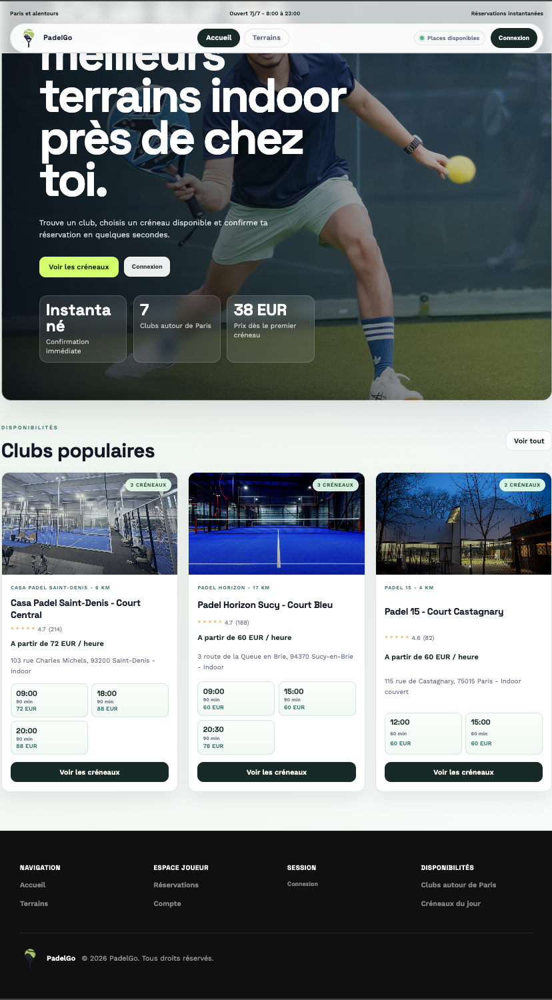
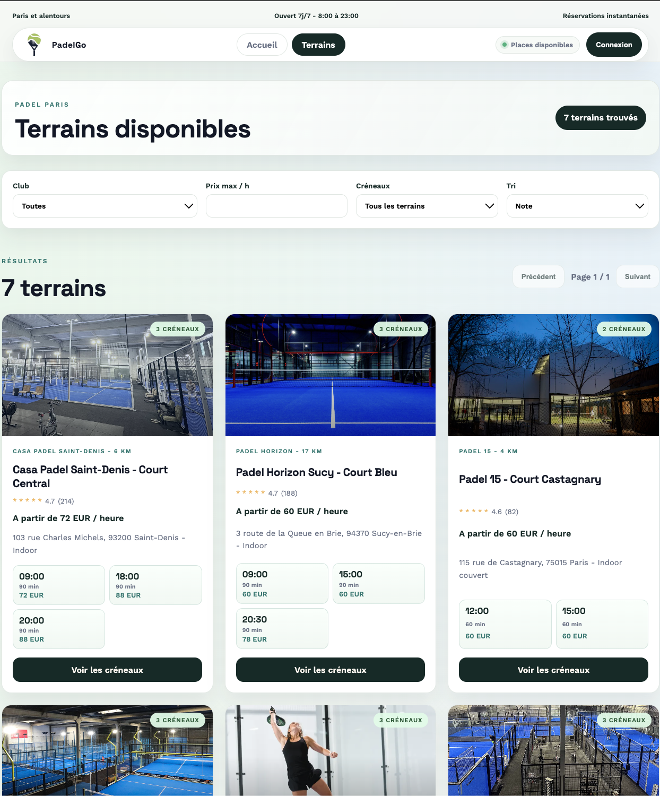
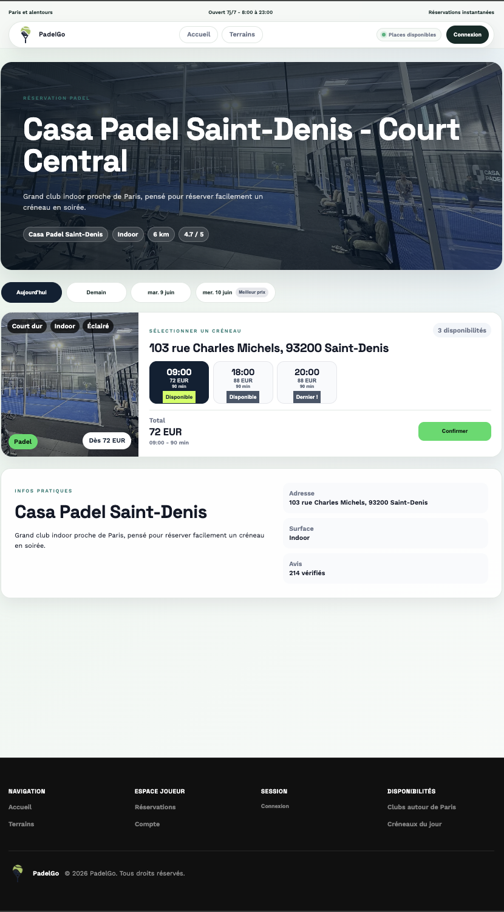
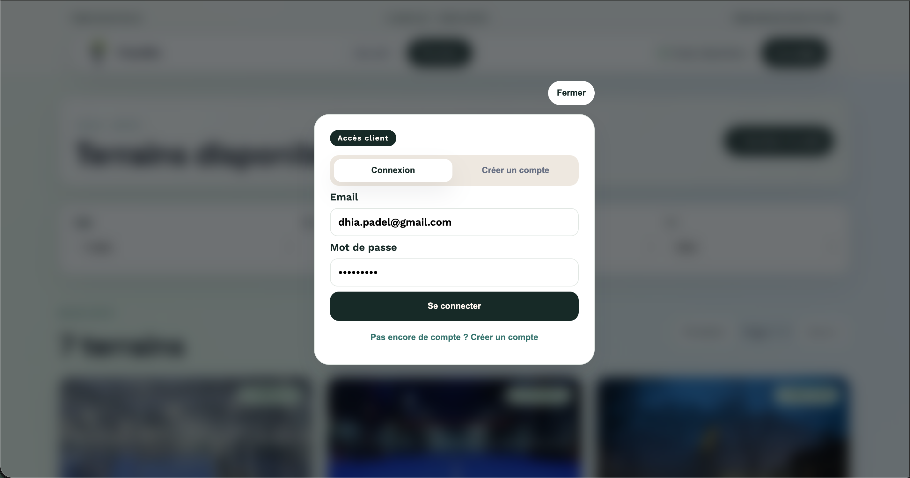
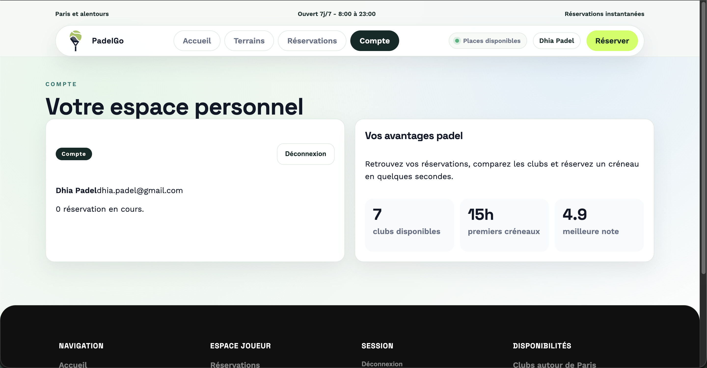
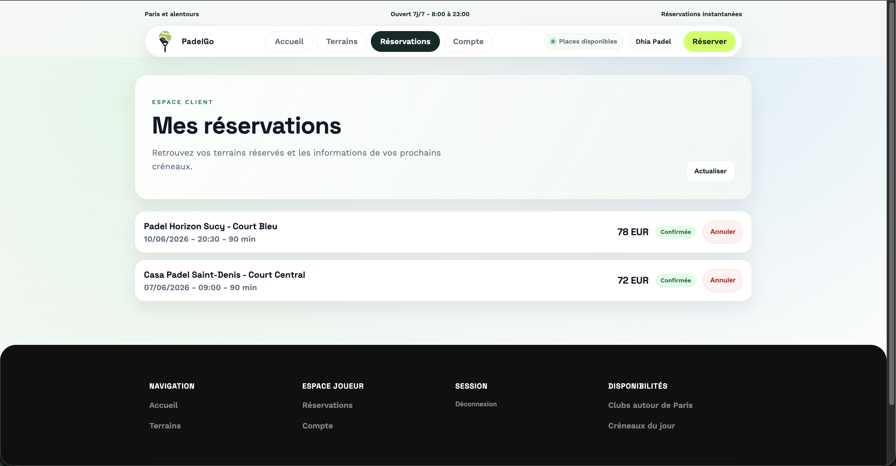
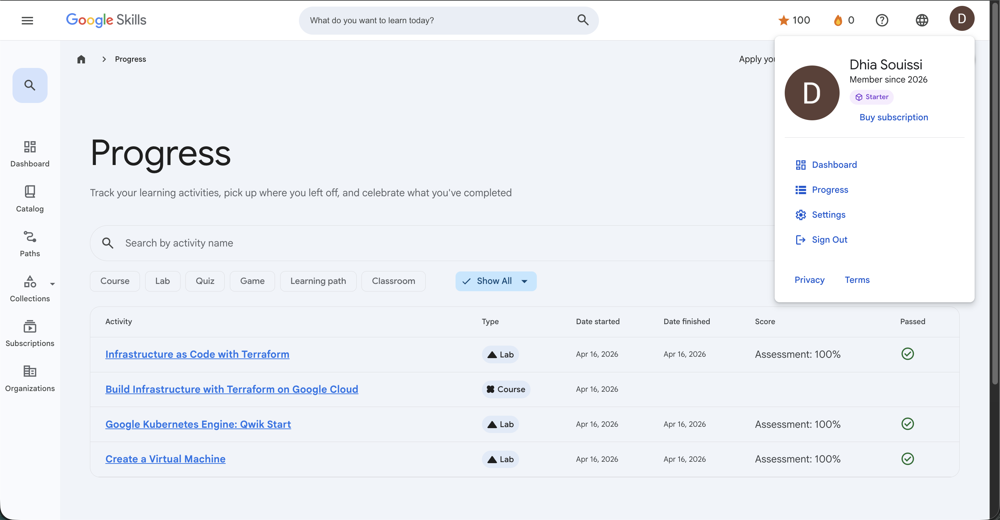
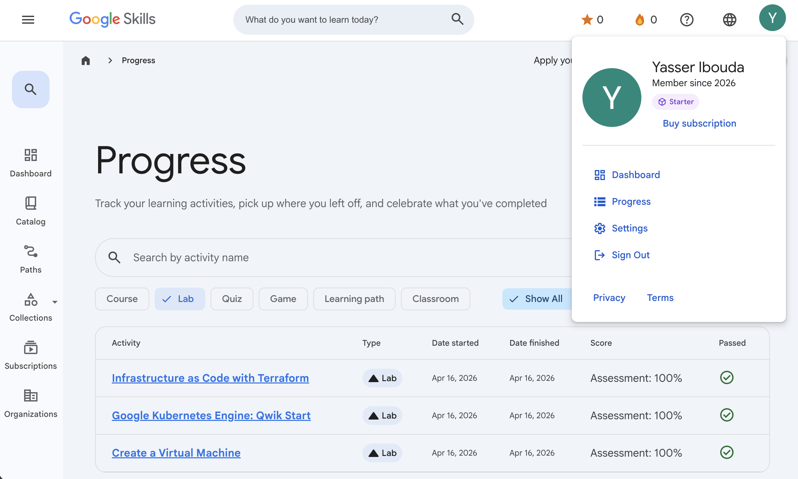

# PadelGo - Projet DevOps Kubernetes M2 MIAGE Groupe 2

## Auteurs

Projet réalisé par :

- **Dhia Eddine SOUISSI**
- **Yasser IBOUDA**

---

## Objectif du projet

Le but du projet est de construire une application web complète basée sur plusieurs services, de la conteneuriser avec **Docker**, puis de la déployer dans **Kubernetes avec Minikube**.

---

## Description de l'application

**PadelGo** est une application de réservation de terrains de padel autour de Paris.

L'utilisateur peut :

- consulter les clubs et terrains disponibles ;
- filtrer les terrains par club, prix et disponibilité ;
- créer un compte ;
- se connecter ;
- réserver un terrain sur une date et un créneau horaire ;
- consulter ses réservations ;
- annuler une réservation.

---

## Architecture

Le projet est composé de trois services principaux :

### Frontend React

- Dossier : `frontend/`
- Image Docker : `dhia78/padelgo-ui:1.0.0`
- Déploiement Kubernetes : `padelgo-ui`
- Service Kubernetes : `padelgo-ui-service`
- Rôle : interface utilisateur servie par NGINX.

### API Node.js / Express

- Dossier : `backend/`
- Image Docker : `dhia78/padelgo-api:1.0.0`
- Déploiement Kubernetes : `padelgo-api`
- Service Kubernetes : `padelgo-api-service`
- Rôle : gestion des clubs, terrains, utilisateurs, connexions et réservations.

### Base de données MySQL

- Image : `mysql:8.4`
- Déploiement Kubernetes : `mysql`
- Service Kubernetes : `mysql`
- Rôle : stockage des utilisateurs, sessions, clubs, terrains et réservations.

---

## Technologies utilisées

- **Frontend** : React, Vite, NGINX
- **Backend** : Node.js, Express
- **Base de données** : MySQL
- **Conteneurisation** : Docker
- **Orchestration** : Kubernetes avec Minikube
- **Gateway** : NGINX Ingress Controller
- **Sécurité Kubernetes** : ServiceAccount, Role, RoleBinding
- **Registry** : Docker Hub

---

## Travail réalisé

### Premier service

Le backend Node.js / Express a été développé, conteneurisé avec Docker, publié sur Docker Hub, puis déployé dans Kubernetes avec un Deployment et un Service.

Fichiers concernés :

- `backend/Dockerfile`
- `k8s/api-deployment.yaml`
- `k8s/api-service.yaml`

### Gateway

L'accès à l'application passe par un Ingress NGINX. Le domaine local utilisé est `padelgo.local`.

Routage :

- `/` vers le frontend ;
- `/api` vers le backend.

Fichier concerné :

- `k8s/ingress.yaml`

### Deuxième service

Un frontend React a été ajouté comme second service. Il est construit avec Docker, servi par NGINX, déployé dans Kubernetes, puis relié au backend via les routes `/api`.

Fichiers concernés :

- `frontend/Dockerfile`
- `k8s/ui-deployment.yaml`
- `k8s/ui-service.yaml`

### Base de données

Une base MySQL a été ajoutée dans Kubernetes. L'API s'y connecte via le service Kubernetes `mysql` et y stocke les utilisateurs, sessions, clubs, terrains et réservations.

Fichiers concernés :

- `k8s/mysql-secret.yaml`
- `k8s/mysql-deployment.yaml`
- `k8s/mysql-service.yaml`

### Sécurisation

Des règles RBAC Kubernetes ont été ajoutées avec un ServiceAccount, un Role et un RoleBinding. Les pods utilisent un compte de service dédié.

Fichiers concernés :

- `k8s/serviceaccount.yaml`
- `k8s/role.yaml`
- `k8s/rolebinding.yaml`

---

## Lancer le projet en local avec Minikube

### 1. Prérequis

Installer :

- Docker Desktop
- kubectl
- Minikube
- Node.js, uniquement pour lancer ou tester en local hors Docker

Cloner le projet :

```bash
git clone https://github.com/dhia78/devops-padelgo.git
cd devops-padelgo
```

---

### 2. Démarrer Minikube

```bash
minikube start
minikube addons enable ingress
```

Lancer aussi le tunnel dans un terminal séparé :

```bash
minikube tunnel
```

---

### 3. Déployer dans Kubernetes

Appliquer les manifests :

```bash
kubectl apply -f k8s/serviceaccount.yaml
kubectl apply -f k8s/role.yaml
kubectl apply -f k8s/rolebinding.yaml

kubectl apply -f k8s/mysql-secret.yaml
kubectl apply -f k8s/mysql-deployment.yaml
kubectl apply -f k8s/mysql-service.yaml

kubectl apply -f k8s/api-deployment.yaml
kubectl apply -f k8s/api-service.yaml

kubectl apply -f k8s/ui-deployment.yaml
kubectl apply -f k8s/ui-service.yaml

kubectl apply -f k8s/ingress.yaml
```

Vérifier :

```bash
kubectl get pods
kubectl get services
kubectl get ingress
```

Résultat attendu :

- `padelgo-api` en `Running`
- `padelgo-ui` en `Running`
- `mysql` en `Running`
- Ingress `padelgo-ingress` visible

---

### 4. Configurer le domaine local

Ajouter le domaine dans `/etc/hosts` :

Windows :

C:\Windows\System32\drivers\etc\hosts

Linux / Mac :

/etc/hosts

Ajouter :

```text
127.0.0.1 padelgo.local
```

Puis ouvrir :

```text
http://padelgo.local
```

---

## Images Docker Hub

Images publiques utilisées dans Kubernetes :

- API : `dhia78/padelgo-api:1.0.0`
- UI : `dhia78/padelgo-ui:1.0.0`

---

## Base de données

La base MySQL est initialisée automatiquement par l'API au démarrage insérant les clubs et terrains de départ dans les tables `clubs` et `courts`.

Tables :

- `users` : comptes utilisateurs ;
- `sessions` : tokens de session ;
- `clubs` : clubs de padel ;
- `courts` : terrains ;
- `reservations` : réservations de créneaux.

La connexion se fait avec les variables Kubernetes :

```text
DB_HOST=mysql
DB_PORT=3306
DB_NAME=padelgo
DB_USER=padelgo_user
DB_PASSWORD=padelgo_password
```

---

### Captures d’écran attendues du site web PadelGo

### Page d'accueil



### Catalogue des terrains



### Détail d'un terrain



### Page de connexion



### Page du compte utilisateur



### Mes réservations



### Captures d’écran – Google Labs 

### SOUISSI Dhia Eddine 



### IBOUDA Yasser



---

## Structure du projet

```text
.
├── backend
│   ├── Dockerfile
│   ├── package.json
│   └── src/server.js
├── frontend
│   ├── Dockerfile
│   ├── index.html
│   ├── nginx/default.conf
│   └── src
└── k8s
    ├── api-deployment.yaml
    ├── api-service.yaml
    ├── ingress.yaml
    ├── mysql-deployment.yaml
    ├── mysql-secret.yaml
    ├── mysql-service.yaml
    ├── role.yaml
    ├── rolebinding.yaml
    ├── serviceaccount.yaml
    ├── ui-deployment.yaml
    └── ui-service.yaml
```

---

## Conclusion

PadelGo met en place une application microservices complète avec :

- un backend API ;
- un frontend React ;
- une base MySQL ;
- des images Docker ;
- un déploiement Kubernetes ;
- une gateway Ingress ;
- des règles RBAC ;
- une communication claire entre les services.
